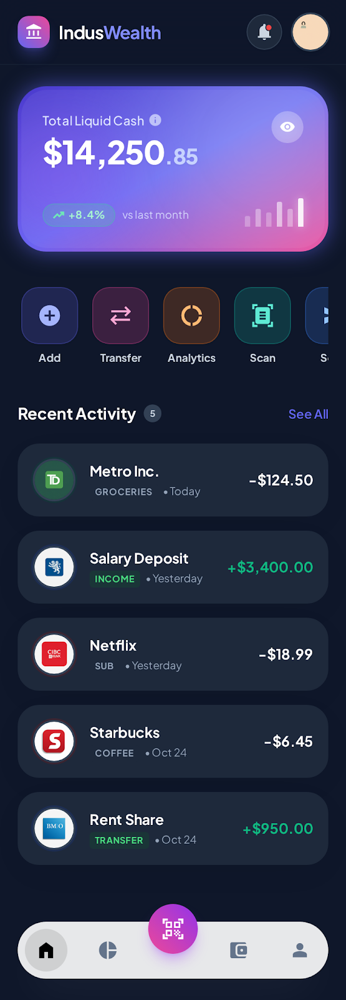

# IndusWealth

**Modern Trust. Intelligent Wealth.**

IndusWealth is a comprehensive personal finance application designed to aggregate your financial life, analyze spending habits, and optimize debt payoff strategies. Built with a "Privacy First" and "Cost Efficient" architecture.



## 🌟 Key Features

### 🔐 Secure Authentication
- **User Accounts**: Secure Login/Signup with robust session management.
- **Profile Management**: customizable settings, dark mode, and security features.

### 💰 Financial Aggregation
- **Plaid Integration**: Seamlessly connect bank accounts (RBC, TD, Amex, etc.).
- **Unified View**: See all your balances and transactions in one beautiful dashboard.

### ⚡ Intelligent Caching Architecture
- **Two-Layer Caching**:
  1. **Local (Mobile)**: AsyncStorage for instant offline access.
  2. **Server (PostgreSQL)**: Durable caching with a **24-hour conservative refresh policy** to minimize external API costs.
- **Smart Sync**: Automatically refreshes data only when stale or requested.

### 🛡️ Watchdog & Analytics
- **Subscription Detection**: Identifies recurring "leaky" payments.
- **Spending Trends**: Visualizes your financial health over time.

### 📉 Debt Attack
- **Payoff Simulator**: Visualize how extra payments impact your debt timeline.
- **Strategies**: Compare "Snowball" vs "Avalanche" methods.

---

## 🏗️ Tech Stack

### Mobile (Frontend)
- **Framework**: React Native (Expo SDK 50+)
- **Navigation**: React Navigation (Tabs + Stacks)
- **Styling**: Custom Theme Engine (Dark/Gold Premium Aesthetic)
- **Charts**: Victory Native

### Backend (API)
- **Runtime**: Node.js & Express
- **Database**: PostgreSQL 15 (Dockerized)
- **Security**: bcryptjs hashing, JWT-ready structure
- **External APIs**: Plaid

---

## 🚀 Getting Started

### Prerequisites
- Node.js (v18+)
- Docker Desktop (for PostgreSQL)
- Expo Go (on mobile) or Android/iOS Simulator

### 1. Database Setup
Start the local PostgreSQL database using Docker Compose:
```bash
docker-compose up -d
```
This will spin up a Postgres instance on port `5432` with persistent storage.

### 2. Backend Setup
Navigate to the backend package and install dependencies:
```bash
cd packages/backend
npm install
```

Create a `.env` file in `packages/backend`:
```env
PORT=3000
DB_HOST=localhost
DB_PORT=5432
DB_NAME=induswealth
DB_USER=induswealth
DB_PASSWORD=induswealth123

# Plaid Keys (Get these from your Plaid Dashboard)
PLAID_CLIENT_ID=your_client_id
PLAID_SECRET=your_secret
PLAID_ENV=sandbox
```

Start the server:
```bash
npm run dev
```

### 3. Mobile Setup
Navigate to the mobile package:
```bash
cd packages/mobile
npm install
```

Start the Expo development server:
```bash
npx expo start
```
Scan the QR code with your phone (Expo Go) or press `a` for Android Emulator.

---

## 📂 Project Structure

```
IndusWealth/
├── docker-compose.yml       # DB Infrastructure
├── packages/
│   ├── backend/             # Node.js API
│   │   ├── db/              # SQL Init Scripts
│   │   ├── src/
│   │   │   ├── routes/      # API Endpoints
│   │   │   └── services/    # Business Logic (Plaid, DB)
│   └── mobile/              # React Native App
│       ├── src/
│       │   ├── screens/     # UI Pages
│       │   ├── navigation/  # App Routing
│       │   └── services/    # API & Cache Clients
```

---

## 🔒 Test Credentials (Sandbox)

- **App Login**:
  - Email: `demo@induswealth.com`
  - Password: `demo123`

- **Plaid Link**:
  - User: `user_good`
  - Password: `pass_good`

---

© 2026 IndusWealth Inc.
